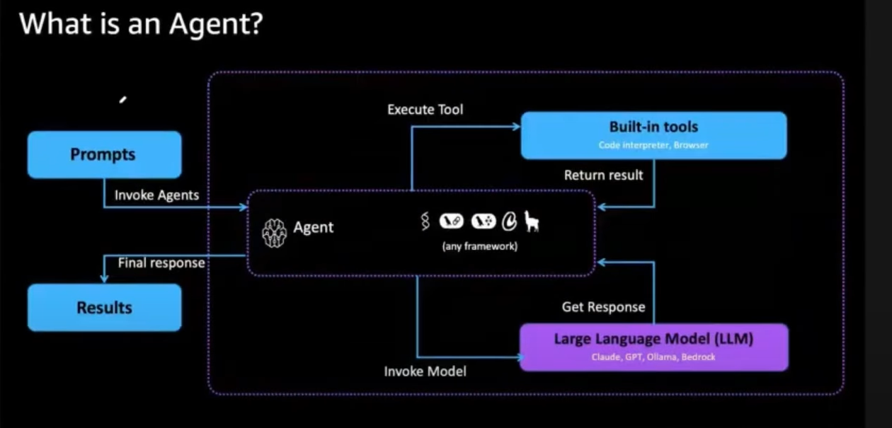

# 🤖 Building GenAI Applications with Strands Agents

<p align="center">
  
  
  
  
</p>

> A modern, modular, and extensible AI Agent framework powered by **Strands Agents** and **Amazon Bedrock** — designed to help you build smart, memory-augmented, and tool-empowered GenAI applications in Python. 🚀

---

## 🌟 Overview

This project demonstrates how to **build intelligent agents** that can:
- Understand and process **natural language prompts**.
- Interact with **LLMs (Large Language Models)** like GPT, Claude, Ollama, and Bedrock.
- Use **built-in tools** such as code interpreters or browsers.
- Store and recall information via **memory modules**.
- Extend capabilities with **Model Context Protocol (MCP)**.

It’s a complete hands-on journey — from **setting up your first AI agent** to integrating advanced features like **memory** and **multi-model orchestration**.

---

## 📚 Learning Path

1. 🧠 **Understanding Amazon Bedrock**  
   Learn how to integrate and deploy generative models securely using AWS Bedrock.

2. 🤖 **Building Your First AI Agent**  
   Create your foundational agent structure in Python.

3. ⚙️ **Powering Up with Tools**  
   Add functionalities like code execution, data lookup, and API calls.

4. 💾 **Adding Memory**  
   Give your agent short-term and long-term recall.

5. 🔗 **MCP Support**  
   Enable interoperability between multiple models and agents.

6. 🎯 **Summing It All Up**  
   Combine everything into a unified, intelligent GenAI app.

---

## 🧩 Architecture Overview

User Prompt → [Agent] → (LLM + Tools + Memory) → Final Response

 


### 🌀 Core Components:
| Component | Description |
|------------|-------------|
| **Prompts** | Natural language instructions from the user. |
| **Agent** | The orchestrator that manages tools, memory, and LLMs. |
| **LLMs** | Large Language Models like Claude, GPT, Ollama, or Bedrock. |
| **Tools** | Built-in extensions (e.g., browser, code executor, API connectors). |
| **Memory** | Stores previous context or chat history. |

---

## 🛠️ Installation

```bash
# Clone this repository
git clone https://github.com/onkarlonkar9/ai-agent-python.git
cd ai-agent-python

# Create virtual environment
python -m venv venv
source venv/bin/activate   # On Windows: venv\Scripts\activate

# Install dependencies
pip install -r requirements.txt

🧰 Tech Stack

Language: Python 🐍

AI Framework: Strands Agents

LLMs: Amazon Bedrock, OpenAI GPT, Anthropic Claude, Ollama

Tools: Custom Plugins, Code Interpreter, Web Browser

Memory: Vector / JSON-based Storage

💬 Passionate about AI, DevOps, and Cloud-Native Applications ☁️

"Agents are not just assistants — they are collaborators in intelligence." 🧩


